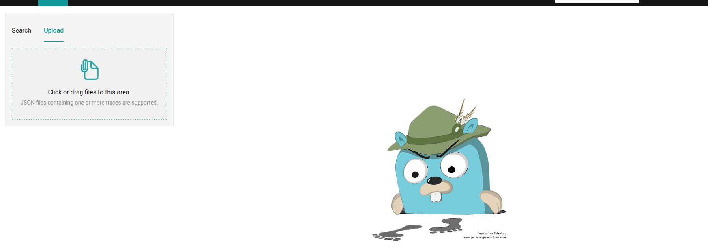
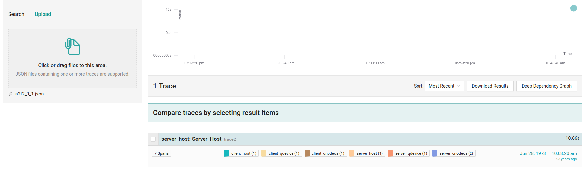
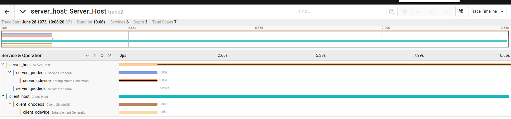

# Generating Distributed Traces from QNodeOS Logs

This repository provides the necessary code and a jupyter notebook for generating Jaeger-compatible distributed traces from logs.

## Repository Structure

+ [lib](lib/): Library code for importing QNodeOS logs; copied from [https://data.4tu.nl/datasets/6aa42f05-6823-4848-b235-3ea19e39f4ae](https://data.4tu.nl/datasets/6aa42f05-6823-4848-b235-3ea19e39f4ae)
+ [notebooks/jaeger_dqc.ipynb](notebooks/jaeger_dqc.ipynb): Jupyter notebook for generating distributed traces
+ [notebooks/traces](notebooks/traces/): Folder where the generated traces will be stored. Currently, this folder has 1200 traces generated from 3 different experimental runs of the Quantum DQC circuit. 1 trace corresponds to 1 shot of the DQC execution.

This repository does not contain the raw logs from QNodeOS. That data is available at the [QNodeOS-artifact](https://data.4tu.nl/datasets/6aa42f05-6823-4848-b235-3ea19e39f4ae). The data folder in the artifact has the raw logs from QNodeOS executions. This repository uses the
dqc_20240304 folder from v1 of the artifact.

## Viewing Traces

Traces can then be uploaded and viewed in Jaeger.

**Step 1: Launch Jaeger.**

To launch jaeger locally, launch the following command:

```
docker run -d --name jaeger -e COLLECTOR_ZIPKIN_HTTP_PORT=9411 -p 5775:5775/udp -p 6831:6831/udp -p 6832:6832/udp -p 5778:5778 -p 16686:16686   -p 14268:14268 -p 9411:9411 -p 4318:4318 jaegertracing/all-in-one:latest
```

This will launch a jaeger server and you can open the UI in your browser at http://localhost:16686.

**Step 2: Upload a Trace**

Click on the Upload button and select one of the generated `.json` files from the traces folder. 



Once the trace is uploaded, the trace will appear on the right.



**Step 3: Viewing the Trace**

Click on the trace to view the timeline of that trace.



